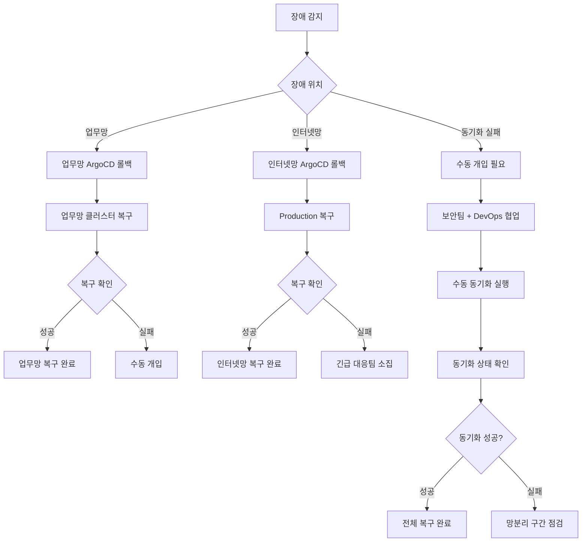
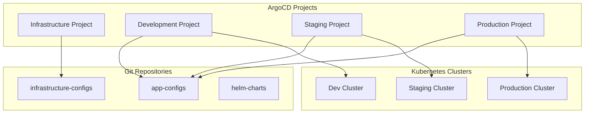
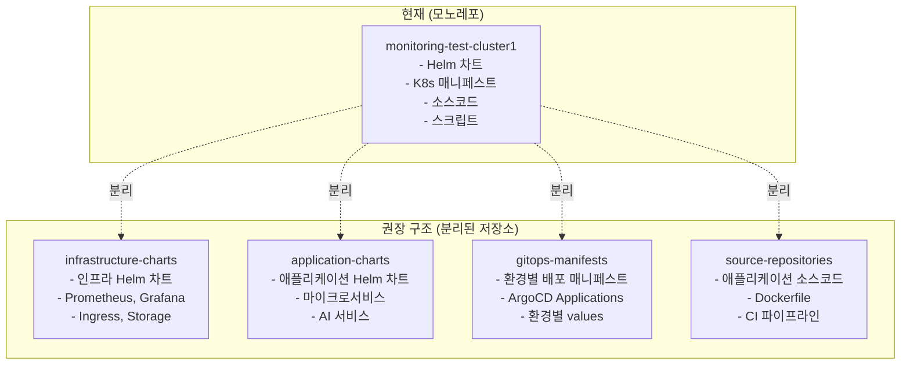

```mermaid
graph TB

<!--more-->
    subgraph "업무망 배포 플로우"
        A[GitOps Repo Update<br/>업무망] --> B[ArgoCD Sync<br/>업무망]
        B --> C{Target Environment}
        C -->|Dev| D[Dev Cluster<br/>업무망]
        C -->|Test| E[Test Cluster<br/>업무망]
        C -->|Staging| F[Staging Cluster<br/>업무망]
    end
    
    subgraph "망분리 동기화"
        G[GitOps Manifest<br/>동기화] --> H[보안 검증]
        H --> I[인터넷망 전송]
    end
    
    subgraph "인터넷망 배포 플로우"
        J[GitOps Repo<br/>인터넷망] --> K[ArgoCD Sync<br/>인터넷망]
        K --> L[Production Cluster<br/>인터넷망]
    end
    
    A -.->|단방향 동기화| G
    I -.-> J
```








---

*Originally published in [Notion](https://www.notion.so/CI-CD-Flow-241eef64a1ca801b9314e0d12d508237) on July 31, 2025*