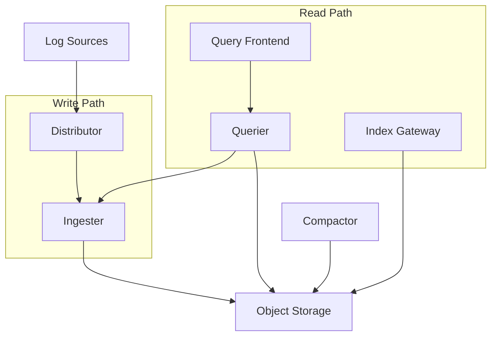

# Loki 배포 모드 선택 가이드: Simple Scalable 모드와 트러블슈팅 전략

로그 데이터의 증가와 함께 Loki의 배포 모드 선택이 중요한 의사결정 요소가 되었습니다. 이번 포스트에서는 Loki의 배포 모드별 특징과 Simple Scalable 모드로의 전환, 그리고 실제 운영 중 발생할 수 있는 트러블슈팅 사례를 공유하겠습니다.

## Loki 배포 모드 개요

### 1. 모놀리식 모드 (Monolithic Mode)

모놀리식 모드는 모든 Loki 컴포넌트가 단일 프로세스에서 실행되는 가장 간단한 배포 방식입니다.

**적합한 사용 사례:**
- 일일 로그 용량 20GB 이하
- 소규모 환경 또는 개발/테스트 환경
- 운영 복잡도를 최소화하고 싶은 경우

**한계점:**
```yaml
# 모놀리식 모드의 한계
일일 로그 처리량: ~20GB
동시 쿼리 제한: 제한적
확장성: 수직 확장만 가능
고가용성: Single Point of Failure
```

### 2. Simple Scalable 모드 (권장)

Simple Scalable 모드는 read와 write 경로를 분리하여 더 나은 성능과 확장성을 제공합니다.

**아키텍처 구성:**


**처리 용량:**
- 일일 로그 용량: 수 TB까지 확장 가능
- 동시 쿼리: 높은 동시성 지원
- 확장성: 수평 확장 가능

### 3. 마이크로서비스 모드

모든 Loki 컴포넌트가 독립적인 서비스로 분리되는 가장 복잡하지만 유연한 배포 방식입니다.

**적합한 환경:**
- 매우 높은 로그 처리량 (TB 단위)
- 복잡한 멀티 테넌트 환경
- 세밀한 리소스 조정이 필요한 경우

## Simple Scalable 모드로의 전환

### 전환이 필요한 시점

현재 모놀리식 모드를 사용 중이라면 다음과 같은 상황에서 Simple Scalable 모드로의 전환을 고려해야 합니다:

```bash
# 모니터링 메트릭으로 확인할 수 있는 지표들
# 1. 로그 처리량 증가
loki_distributor_bytes_received_total > 20GB/day

# 2. 쿼리 응답 시간 증가
histogram_quantile(0.95, loki_request_duration_seconds) > 10s

# 3. 메모리 사용량 증가
loki_ingester_memory_series > 1000000
```

### 전환 절차

**1. 기존 데이터 백업**
```bash
# Loki 데이터 백업
kubectl create backup loki-backup-$(date +%Y%m%d)
```

**2. Simple Scalable 설정 준비**
```yaml
# loki-simple-scalable-values.yaml
loki:
  structuredConfig:
    ingester:
      max_chunk_age: 1h
      max_simultaneous_streams: 1000
      max_simultaneous_streams_per_user: 500
    
    limits_config:
      enforce_metric_name: false
      reject_old_samples: true
      reject_old_samples_max_age: 168h
      max_cache_freshness_per_query: 10m
      
    compactor:
      shared_store: s3
      compaction_interval: 5m
      
  schemaConfig:
    configs:
      - from: 2024-01-01
        store: tsdb
        object_store: s3
        schema: v13
        index:
          prefix: index_
          period: 24h

# 리소스 할당
resources:
  read:
    requests:
      cpu: 500m
      memory: 1Gi
    limits:
      cpu: 2
      memory: 4Gi
  write:
    requests:
      cpu: 500m
      memory: 2Gi  
    limits:
      cpu: 2
      memory: 8Gi
```

**3. 단계적 배포**
```bash
# 1. Read 컴포넌트부터 배포
helm upgrade loki grafana/loki \
  -f loki-simple-scalable-values.yaml \
  --set read.replicas=2

# 2. Write 컴포넌트 배포  
helm upgrade loki grafana/loki \
  -f loki-simple-scalable-values.yaml \
  --set write.replicas=3
```

## 트러블슈팅 사례: Multi-tenancy 401 에러

### 문제 상황

Loki를 Single-tenant 모드로 운영 중 다음과 같은 401 Unauthorized 에러가 발생할 수 있습니다:

```bash
# 에러 로그 예시
level=warn ts=2025-09-10T10:30:00.000Z caller=middleware.go msg="error authenticating request" err="no tenant ID found"

# FluentBit 에러
[2025/09/10 10:30:00] [error] [output:loki:loki.0] HTTP status=401
```

### 원인 분석

```yaml
# Loki 설정에서 auth_enabled: false로 설정된 경우
auth_enabled: false  # Single-tenant 모드
```

Single-tenant 모드에서는 기본적으로 `fake` tenant가 사용되지만, 클라이언트에서 적절한 헤더를 전송하지 않으면 인증 에러가 발생합니다.

### 해결 방법

**방법 1: FluentBit 설정에서 헤더 추가**
```conf
# fluent-bit.conf
[OUTPUT]
    Name        loki
    Match       *
    Host        loki-gateway.monitoring.svc.cluster.local
    Port        80
    Http_User   
    Http_Passwd 
    # Single-tenant 모드를 위한 헤더 추가
    header      X-Scope-OrgID fake
    uri         /loki/api/v1/push
    format      json
    labels      job=fluent-bit
```

**방법 2: Nginx Proxy에서 헤더 주입**
```nginx
# nginx.conf
server {
    listen 80;
    server_name loki-proxy.monitoring.local;
    
    location /loki/api/v1/push {
        # Single-tenant용 기본 헤더 추가
        proxy_set_header X-Scope-OrgID fake;
        proxy_pass http://loki-backend:3100;
        proxy_set_header Host $host;
        proxy_set_header X-Real-IP $remote_addr;
        proxy_set_header X-Forwarded-For $proxy_add_x_forwarded_for;
    }
    
    location /loki/api/v1/query {
        proxy_set_header X-Scope-OrgID fake;
        proxy_pass http://loki-backend:3100;
    }
}
```

**방법 3: Grafana Agent/Alloy 설정**
```yaml
# agent.yaml
loki.write "default" {
  endpoint {
    url = "http://loki-gateway.monitoring.svc.cluster.local/loki/api/v1/push"
    
    # Single-tenant 헤더 설정
    headers = {
      "X-Scope-OrgID" = "fake"
    }
  }
}
```

### 검증 방법

헤더 설정 후 다음 명령으로 정상 작동을 확인할 수 있습니다:

```bash
# 직접 API 호출 테스트
curl -X POST \
  -H "Content-Type: application/json" \
  -H "X-Scope-OrgID: fake" \
  -d '{"streams": [{"stream": {"job": "test"}, "values": [["1694000000000000000", "test log message"]]}]}' \
  http://loki-gateway.monitoring.svc.cluster.local/loki/api/v1/push

# 쿼리 테스트
curl -G \
  -H "X-Scope-OrgID: fake" \
  --data-urlencode 'query={job="test"}' \
  --data-urlencode 'limit=10' \
  http://loki-gateway.monitoring.svc.cluster.local/loki/api/v1/query
```

## 성능 최적화 팁

### 1. 인덱싱 전략

```yaml
# 효율적인 라벨 구성
# 좋은 예
{job="api-server", environment="production", region="us-west-2"}

# 피해야 할 예 (높은 카디널리티)
{job="api-server", request_id="12345678-1234-1234-1234-123456789012"}
```

### 2. 청크 설정 최적화

```yaml
# loki-config.yaml
ingester:
  max_chunk_age: 1h          # 청크 최대 보존 시간
  chunk_target_size: 1572864 # 1.5MB 목표 크기
  chunk_block_size: 262144   # 256KB 블록 크기
```

### 3. 메모리 사용량 모니터링

```promql
# Loki 메모리 사용량 모니터링 쿼리
container_memory_usage_bytes{pod=~"loki-.*"}

# 인제스터별 시리즈 수 모니터링  
loki_ingester_memory_series
```

## 결론

Loki의 배포 모드 선택은 로그 처리량과 운영 복잡도 사이의 트레이드오프입니다:

- **20GB/일 이하**: 모놀리식 모드
- **20GB~수TB/일**: Simple Scalable 모드 (권장)  
- **수TB/일 이상**: 마이크로서비스 모드

Simple Scalable 모드로의 전환 시에는 단계적 배포와 충분한 테스트를 통해 안정성을 확보하고, Multi-tenancy 관련 설정을 정확히 구성하여 인증 에러를 방지하는 것이 중요합니다.